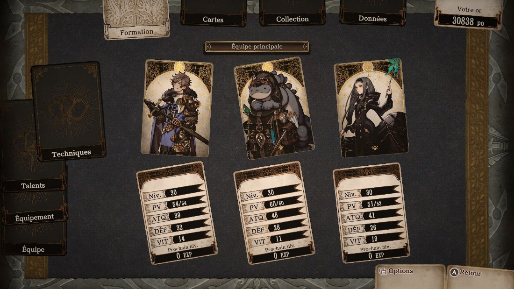
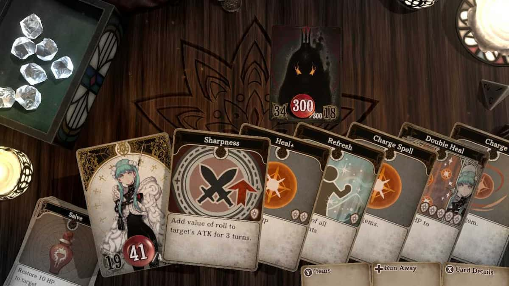
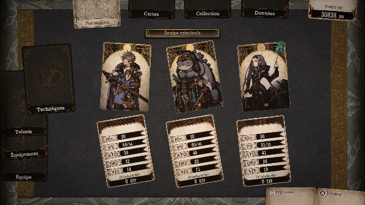
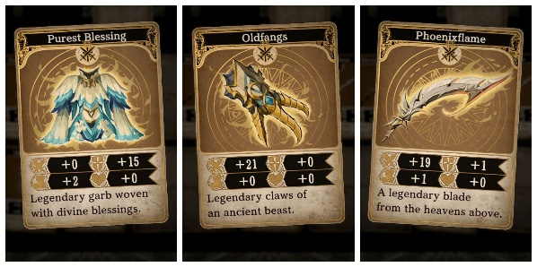

# WAFE — Donjon
> Source : OneNote `WAFE - Donjon.docx` (nov. 2020 → juil. 2023)
> Fait partie de la famille WAFE — voir [02_WAFE_UNIVERS.md](02_WAFE_UNIVERS.md)
> Le concept Notion "Donjon à plusieurs" a été intégré à ce fichier (voir § Mécanique de positionnement).

---

## Résumé

| | |
|---|---|
| **Thème** | Donjon, Combats, Aventure coopérative |
| **État** | Deux versions documentées (V1 et V2) — maturité non définie dans la source |
| **Type** | Cartes + Dés [Source OneNote] |
| **Joueurs** | 2 à 6 [Source Notion] |
| **Difficulté** | Non définie dans la source WAFE |
| **Interaction** | Coopération [Inférence : présence d’un groupe de personnages — non confirmé] |
| **Envie de dév.** | — [Non renseigné dans la source WAFE] |
| **Inspirations** | Voice of Cards, Pokémon, Dungeon & Dragons, Mice and Mystics |

> *Mode donjon de l'univers WAFE. Les joueurs choisissent un rôle (humain, animal ou élément) et explorent un plateau de cartes retournées — trésors, monstres, pièges, reliques. Un système de piste d'initiative détermine l'ordre des actions. Les personnages sont représentés par des cartes que l'on tourne pour indiquer leurs ressources restantes.*

---

## Concept de base *(19 novembre 2020)*

### Le plateau

- Carré de **cartes retournées** tiré au sort
- Types de cases : Trésor + nombre · Monstre + nombre · Piège · Relique
- **Piste d'initiative** : tous les membres du groupe + les monstres y figurent

### Dés combat *(distribution de 0 à 3)*

| Face | Occurrences |
|------|-------------|
| 0 | ×1 |
| 1 | ×2 |
| 2 | ×2 |
| 3 | ×1 |

### Niveaux de monstres

Monstre Easy · Monstre Medium · Monstre Hard

### Démarrage fun

Au départ : items en carton au comportement inattendu — *ex : bouclier qui renvoie les dégâts sur le coéquipier de gauche/droite, item qui frappe à côté*.

---

## Personnages *(29 janvier 2023)*

### Mécanique de la carte personnage

La carte personnage se **tourne et se retourne** pour indiquer les ressources :

| Rotation | Effet |
|----------|-------|
| Quart de tour | Diminue PV (humain) / Esprit (animal) / Mana (élément) |
| Retournée | Inapte à attaquer |
| Réinitialisation | À chaque combat ? À chaque donjon ? *(à définir)* |

### Mécanique de positionnement *(Source Notion — Donjon à plusieurs)*

Inspiré de **Voice of Cards**. Joueurs : 2 à 6.

- Les cartes de personnage sont **collées** les unes aux autres pour interagir.
- Les attaques possibles dépendent de la **position relative** des cartes.

> Questions ouvertes : que signifie précisément « cartes collées » (adjacence orthogonale, contact quelconque, formation imposée) ? Comment la position détermine-t-elle la portée et les cibles ?

---

### Humains — Classes jouables (V1)

| Race | Caractéristique | Armure | Vitesse | Attaque |
|------|----------------|--------|---------|---------|
| Druide | Animaux : peut utiliser jusqu'à 2 animaux | 0 | 2 | 1 |
| Barde | Muse : permet un déplacement en plus par tour | 0 | — | 2 |
| Guerrier | Furie : peut faire une deuxième attaque suite à un coup critique | 2 | — | — |
| Guérisseur | Soin : peut rendre un dé de 6 de soin une fois par niveau | 0 | — | — |
| Élémentaliste | Peut utiliser un sort d'élément gratuitement par tour | 3 | — | — |
| Chasseur | Sniper : peut faire une 2e attaque à distance sur coup critique | 1 | — | — |
| Assassin | — | 0 | — | — |
| Défenseur | — | 0 | — | — |

*(Leur position sur la carte affiche le nombre de points de vie)*

---

### Animaux

Leur position affiche leur reste d'**esprit**.

| Animal | Compétence | Effet |
|--------|-----------|-------|
| Lapin | Saut d'évasion (2) | Évite une attaque |
| Renard | Ruse | Échange sa place avec quelqu'un sur la file d'initiative |
| Ours | Hurlement bestial | +2 dés pour l'attaque |
| Hibou | Piquet offensif (2) | Avance de 2 places sur la piste d'attaque |
| Tortue | Repli défensif (2) | Protège de 2 pts d'attaque |

*(V2 : les animaux sont passifs)*

---

### Éléments

Leur position affiche leur reste de **mana**. V2 : peut avoir un élément **primaire ET un secondaire**.

---

## Sorts élémentaires

### Niveau 1

| Élément | Sort | Effet |
|---------|------|-------|
| Eau | Eau rafraîchissante | +2 PV à la cible |
| Feu | Boule de feu | Dégâts sur la cible + 1 dégât sur les cibles avant et après elle sur la piste |
| Terre | Mur d'argile | +2 défense à soi ou un allié lors de l'attaque |
| Air | Souffle de célérité | Avance la cible de +2 sur la piste, ou recule l'ennemi de 2 |

### Niveau 2

| Élément | Sort | Effet |
|---------|------|-------|
| Plante | Écorce curative | +2 PV + protège de 2 pour la prochaine attaque |
| Électricité | Fulgurance | Passe premier sur la piste d'initiative |
| Brume | Disparition en fumée | Inciblable jusqu'à la prochaine attaque |
| Lave | Boule de magma | Dégâts en ignorant l'armure |

### Niveau 3

| Élément | Sort | Effet |
|---------|------|-------|
| Glace | Cryogénie | Ramène la cible à la vie avec 1 PV |
| Son | Symphonie | Tous les alliés avancent de 1 sur la piste d'initiative |
| Lumière | Laser orbital | Dégâts ×2 |
| Métal | Rempart d'acier | Insensible à la prochaine attaque |

---

## Équipements

### Armes *(bonus + malus)*

| Arme | Bonus | Malus |
|------|-------|-------|
| Arc | Si touche → avance d'un rang sur la piste d'initiative | Si loupe → attaque la prochaine cible sur la piste |
| Grande épée | Si touche la 1ère cible → +1 dégât | Attaque en cascade tant qu'il ne touche pas |
| Boomerang | Si touche → peut attaquer la cible adjacente | Si loupe → attaque son propre porteur |
| Marteau | Si ATK > DEF cible de 2 → assomme 1 tour | Si loupe → recule d'une case sur la piste d'initiative |
| Dague | Ignore l'armure | Si résultat > 2 → loupe l'attaque |
| Lance | Si résultat > 2 → attaque une seconde cible | Si résultat = 3 → perd l'arme pendant 1 tour |

*V2 : chaque arme a 3 modes — attaque · attaque critique · échec*

### Armures — V1 Personnage

| Catégorie | Défense | Nom | Effet |
|-----------|---------|-----|-------|
| Lourde | 2 | Armure d'écorces | Max défense → ricoche sur le suivant dans la piste |
| Lourde | 2 | Armure d'épine | Inflige 1 dégât quand touché |
| Lourde | 2 | Armure flamboyante | Attire les attaques ennemies |
| Moyenne | 1 | Armure de cuir | Réduit de 1 le coût d'esprit quand max dés |
| Légère | 0 | Armure tressée | Avance d'un sur la piste d'initiative quand esquive |
| Légère | 0 | Robe d'érudit | Réduit de 1 le coût des éléments quand max dés |

### Armures — V2

| Catégorie | Défense | Nom | Effet |
|-----------|---------|-----|-------|
| Lourde | 2 | Armure d'épine | Inflige 1 dégât quand touché |
| Lourde | 2 | Armure flamboyante | Attire les attaques |
| Moyenne | 1 | Armure de cuir | Réduit de 1 le coût des attaques d'animaux |
| Légère | 0 | Armure tressée | Avance d'un sur la piste d'initiative quand esquive |
| Légère | 0 | Robe d'érudit | +1 aux dégâts des éléments |

---

## Ennemis *(29 janvier 2023)*

### Zones par élément

| Niveau | Élément | Ennemis |
|--------|---------|---------|
| 1 | Eau | Grenouilles |
| 1 | Feu | Serpents · Scorpion |
| 1 | Terre | Ours |
| 1 | Air | Aigle · Vautour |
| 2 | Plante | *(à définir)* |
| 2 | Électricité | *(à définir)* |
| 2 | Brume | *(à définir)* |
| 2 | Lave | *(à définir)* |
| 3 | Glace | *(à définir)* |
| 3 | Son | *(à définir)* |
| 3 | Lumière | *(à définir)* |
| 3 | Métal | *(à définir)* |

**Catégories globales :** Blobs · Élémentaires · Animaux · Animaux élémentaires · Humanoïdes · Humanoïdes élémentaires · Humanoïdes élémentaires animaux

---

## JEU V1 — Matériel *(10 juillet 2023)*

### Questions ouvertes

- Dés pour les PV et l'énergie/esprit/mana ?
- Énergie comme Mice and Mystics : 1 gemme de mana/tour · 1 gemme d'esprit/coup touché · 3 gemmes d'énergie/fin de tour
- Dés pour les dégâts sur joueurs/monstres

### Dés

| Dé | Faces |
|----|-------|
| 1× D6 Événement | Repos · Trésor (armes) · Élément · Bête · Monstre |
| 2× D6 Nature *ou* 1× D12 | Eau · Terre · Feu · Air · Rien · Rien |
| 1× D6 Réussite | 2 échecs (dégâts avec désav.) · 2 réussites (dégâts) · 1 réussite critique (dégâts + avantage) · 1 échec critique |
| 1× D6 | Dégâts |
| 2× D8 Zone | 1 avec chiffres + 1 avec lettres |

### Cartes

- Cartes normales : Armes · Éléments · Animaux · Monstres · Personnages
- 12 cartes carrées : chaque type de terrain

### Plateau

- **Plateau 12×12** avec :
  - ↑ Haut : piste niveaux de donjon *(boss tous les 7)*
  - ↓ Bas : piste des Boss
  - → Droite : piste joueurs/monstres
  - ← Gauche : piles de cartes
- **Plateau 8×8** pour les combats *(ou plus ?)*

### Statistiques

Niveau · Santé · Armure · Déplacement · Attaque · (Portée)

### Terrains

| Terrain | Effet |
|---------|-------|
| Eau | +1 santé par tour |
| Feu | +1 dégât par tour |
| Terre | Montagne en carré : +1 hauteur, centre +2 |
| Air | +1 déplacement |
| Plante | Arbre en croix : +1, centre +2 |
| Électricité | Pas d'arme au corps-à-corps |
| Brume | Pas d'attaque à distance |
| Lave | Montagne (0 au centre) + dégât de feu |
| Glace | Déplacement en ligne (glissade) |
| Son | Pas d'éléments |
| Lumière | Pas d'action |
| Métal | +2 en forme de + |

### Énergie (Spells)

| Type | Règle |
|------|-------|
| Armes | 3 pts au début du tour, +1 par tour |
| Animaux | 0 pt au départ, +1 par attaque réussie |
| Éléments | 3 pts au début du tour, +3 par zone absorbée ou repos |

---

## JEU V2 *(10 juillet 2023)*

**Références V2 :** Pokémon (attaques) · Dungeon & Dragons · Voice of Cards

**Ajout V2 :** À chaque apparition de monstre → pose un élément sur le plateau

### Dés V2

| Dé | Faces |
|----|-------|
| 1× D6 Événement | Événement · Événement · Repos · Rencontre Simple · Rencontre Moyen · Rencontre Fort |
| Autres dés | Identiques à V1 |

### Événements V2

| Événement | Effet |
|-----------|-------|
| Élément sur personnage | Apparition d'un élément avec background |
| Soins | — |
| Trésor | — |
| Pertes d'items | — |
| Bonus de stats | — |

### Étages V2

| Niveau | Caractéristiques |
|--------|-----------------|
| 1 | 1 monstre — première rencontre simple |
| 2–8 | Dé aléatoire |
| 9 | Boss |
| 10 | Repos + Trésor (jet de 6) |

### Paliers de difficulté V2

| Niveau | Type Monstres | Description |
|--------|--------------|-------------|
| 1 | E | Éléments simples |
| 2 | A | Animaux |
| 3 | AE | Animaux éléments |
| 4 | H | Humanoïdes |
| 5 | HE | Humanoïdes éléments |
| 6 | HA | Humanoïdes animaux |
| 7 | HEA | Humanoïdes éléments animaux |

---

## Divinités — Péchés et Vertus *(V2)*

### Les 7 Péchés

| Péché | Pouvoir |
|-------|---------|
| Avarice | *(à définir)* |
| Colère | Enragement — augmente les dégâts chaque tour |
| Envie | *(à définir)* |
| Gourmandise | *(à définir)* |
| Luxure | Charme |
| Orgueil | *(à définir)* |
| Paresse | *(à définir)* |

### Les 7 Vertus

| Vertu | Pouvoir |
|-------|---------|
| Justice | Quand un ennemi ou soi-même fait une réussite/échec critique → l'autre partie reçoit automatiquement la même chose |
| Courage | *(à définir)* |
| Bonté | *(à définir)* |
| Tempérance | *(à définir)* |
| Vérité | *(à définir)* |
| Humilité | Ne peut pas faire de réussite ou échec critique |
| Loyauté | Ne peut pas mourir si un partenaire est encore en vie |

### Idées de pouvoirs divins

Charme · Gravité · Changement de masse · Changement de taille · Boost d'une caractéristique aléatoire · Voler les pouvoirs · Enragement · Contrôle du temps · Augmenter une caract. au maximum (dégâts / vie / rapidité / armure) · Prévoyance · Passer à travers les éléments · Télékinésie / Télépathie · Oubli / Blocage des compétences

---

## Images (sources OneNote)

- `assets/wafe-donjon/image1.jpeg`
- `assets/wafe-donjon/image2.jpg`
- `assets/wafe-donjon/image3.jpeg`
- `assets/wafe-donjon/image4.jpeg`
- `assets/wafe-donjon/image5.jpeg`

---

<!-- SOURCE-ARCHIVE:BEGIN -->
## Annexe — Notes sources exhaustives

Afficher la transcription exhaustive et les variantes historiques

> Cette annexe est la couche de référence restaurée depuis Mixologie avant restructuration (7db5550). Elle ne doit pas être condensée. Seuls les chemins des médias ont été adaptés à la nouvelle arborescence.

> **Couche exhaustive — WAFE — Donjon.** Ce document conserve les formulations, variantes, répétitions, dates, tableaux et médias issus des exports. Il fait foi lorsqu’une synthèse éditoriale simplifie ou interprète un point.

# WAFE — Donjon

## Général

jeudi 19 novembre 2020

14:55

Plateau de donjon avec une liste de cartes pour faire un carré de cartes retournées :

- Trésor + nombre (carte équipements ou de sorts)

- Monstre + nombre

- Piège

- Relique

Des dès d'attaque et défense de 0 à 3 :  

- 1x 0

- 2x 1

- 2x 2

- 1x 3

Liste de monstres :

- Monstre easy

- Monstre medium

- Monstre Hard

Chacun choisi un rôle, au départ on commence avec des items en cartons mais fun (Bouclier qui renvoi les dégats sur son coéquipier de gauche ou de droite, item qui frappe à côté)

Piste d'initiative avec les différents membres + les monstres

## Personnage

dimanche 29 janvier 2023

20:47

On peut tourner la carte d'un quart de tour pour diminuer son nombre de pv pour le personnage, esprit pour l'animal, mana pour la mana.

On peut retourner la carte pour considérer comme inapte à attaquer

Ca se réinitialise à chaque combat ou donjon ?

Personnages : 

- Humain : En fonction de sa position, affiche le nombre de points de vie

- Animaux : En fonction de sa position, affiche son reste d'esprit

  - Lapin

    - Saut d'évasion (2) : permet d'éviter une attaque

  - Renard

    - Ruse : remplace sa place avec quelqu'un sur la file

  - Ours

    - Hurlement bestial : Augmente les dés de 2 pour l'attaque

  - Hibou

    - Piquet offensif (2) : avance de 2 places dans la file d'attaque

  - Tortue

    - Repli défensif (2) : Protège de 2 points d'attaque

- Elements : En fonction de sa position, affiche son reste de mana

  - Niveau 1 :

    - Eau :

      - Eau rafraichissante : Soigne la cible de 2 points de vie

    - Feu :

      - Boule de feu : Inflige des dégats et touche les personnes avant et après sur la piste d'attaque avec 1 de degats de moins

    - Terre

      - Mur d'argile : Ajoute 2 de défense à soi ou l'allié lors de l'attaque

    - Air

      - Souffle de célérité : Avance la personne de 2 sur la piste d'attaque ou recule de 2 la personne ciblée

  - Niveau 2 :

    - Plante

      - Ecorce curative : soigne de 2 points et protège de 2 pour la prochaine attaque

    - Electricité :

      - Fulgurance : Passe premier sur la piste d'initiative

    - Brume

      - Disparition en fumée : Ne peut pas être ciblé jusqu'à la prochaine attaque

    - Lave

      - Boule de magma : Inflige des dégats en ignorants l'armure

  - Niveau 3 :

    - Glace :

      - Cryogénie : Ramène la cible à la vie avec 1pt de vie

    - Son :

      - Symphonie : Avance tous les alliés de 1 sur la piste d'initiative 

    - Lumière :

      - Laser orbital : inflige les degats x2 

    - Métal

      - Rempart d'acier : Rend insensible à la prochaine attaque

- Equipements :

  - Armes :

    - Arc :  

      - Bonus : Si touche, avance d'un rang sur la piste d'initiative

      - Malus : Quand vous loupez votre cible, vous attaquez la prochaine cible sur la piste d'attaque

    - Grande épée :

      - Bonus : Si touche la première cible, inflige un dégat de plus

      - Malus : Attaque tant qu'il ne touche pas sa cible les cibles dans l'ordre de la piste d'attaque

    - Boomerang : 

      - Bonus : SI touche, peut attaquer la cible à côté

      - Malus : Si loupe sa cible, attaque son porteur

    - Marteau : 

      - Bonus : si 2 points d'attaque de plus que la cible, l'assomme un tour

      - Malus : Quand loupé, recule d'une case sur la piste d'initiative

    - Dague

      - Bonus : ignore l'armure

      - Malus: si fait plus de 2, loupe son attaque

    - Lance

      - Bonus : plus de 2, attaque une seconde cible

      - Malus : si 3, perd son arme pendant 1 tour

  - 2quipements :

    - Lourde (2 défense)

      - Armure d'écorces : Quand vous faites le maximum de défense, ricoche pour toucher le prochain sur la piste d'attaque

      - Armure d'épine : inflige 1 de dégât quand touché

      - Armure flamboyante : attire les attaques

    - Moyenne (1 défense)

      - Armure de cuir : Réduit de 1 le cout d'esprit quand maximum dès

    - Légère (0 défense)

      - Armure tressée : Avance d'un sur la piste d'initiative quand évite une attaque

      - Robe d'érudit : Réduit de 1 le cout des éléments quand maximum dès

## Ennemis

dimanche 29 janvier 2023

23:03

Zones :

- Niveau 1 :

  - Eau :

    - Grenouilles

  - Feu :

    - Serpents

    - Scorpion

  - Terre

    - Ours

  - Air

    - Aigle

    - Vautour

- Niveau 2 :

  - Plante

  - Electricité

  - Brume

  - Lave

- Niveau 3 :

  - Glace

  - Son

  - Lumière

  - Métal

## JEU V1

lundi 10 juillet 2023

20:23

[https://cdn.1j1ju.com/medias/7a/ea/a9-mice-and-mystics-regle.pdf](https://cdn.1j1ju.com/medias/7a/ea/a9-mice-and-mystics-regle.pdf)

Question :

  - Des dès pour faire les points de vie et les points d'énergie/esprit/mana ?

  - Revoir pour que l'énergie fonctionne comme pour mice and mystics

    - Une gemme de mana par tour

    - Une gemme d'esprit à chaque coup touché

    - Trois gemmes d'énergie à la fin de chaque tour

  - Des dès pour faire les dégats sur les joueurs/monstres

Matériel :

  - Dès

    - 1x Dès 6 d'évènement

      - Repos : restauration vie

      - Trésor : armes

      - Element

      - Bête

      - Monstre

    - 2 x Dès 6 de Nature ou 1 Dès 12

      - 1x Eau

      - 1x Terre

      - 1x Feu

      - 1 x Air

      - 2x Rien

    - 1 Dès de 6 de réussite

      - 2 échecs : dégats avec désavantage

      - 2 réussites : dégats

      - 1 Réussite critique : dégats avec avantage

      - 1 Echec critique : 

    - 1 Dès de 6 : dégats

    - 2 Dès pour la zone sur le plateau : 1 Dès de 8 avec des chiffres  1 Dès de 8 avec des lettres

  - Cartes normales

    - 12 cartes pour les types

    - Armes

    - Eléments

    - Animaux

    - Monstres

    - Personnages

  - 12 Cartes carrés : chaque type de terrain

  - 1 plateau de 12 par 12 avec numérotation 

    - Haut : piste avancement des niveaux de donjon (tous les 7 un boss)

    - Bas : piste avancement des Boss

    - Droite : piste avancement des joueurs/monstres

    - Gauche : piles de carte

Plateau de 8x8 pour les combats ou plus ?

Statistiques :

  - Niveau

  - Santé

  - Armure

  - Déplacement

  - Attaque (Portée)

Terrains :

  - Eau : +1 de santé par tour

  - Feu : +1 de dégat par tour

  - Terre : montagne en carré+1 hauteur et centre+2

  - Air : +1 déplacement 

  - Plante : arbre en croix +1 avec +2 au centre

  - Electricité : pas d'arme au cac

  - Brume : pas d'attaque à distance

  - Lave : Montagne avec 0 au centre et dégât de feu

  - Glace : déplacement en ligne (glissade)

  - Son : pas d'éléments

  - Lumière : pas d'action

  - Métal : +2 en forme de +

Humanoide  :

| Race | Caractéristique | Santé | Armure | Vitesse | Attaque | Arme de départ | Amure départ |
| --- | --- | --- | --- | --- | --- | --- | --- |
| Druide | Amimaux : Peut utiliser jusqu'à 2 animaux |  | 0 | 2 | 1 |  |  |
| Barde | Muse : Permet un déplacement en plus par tour |  | 0 |  | 2 |  |  |
| Guerrier | Furie : Peut faire une deuxième attaque suite à un coup critique |  | 2 |  |  |  |  |
| Guerisseur | Soin : Peut rendre un dès de 6 de soin une fois par niveau |  | 0 |  |  |  |  |
| Elementaliste | Peut utiliser un sort d'élément gratuitement par tour |  | 3 |  |  |  |  |
| Chasseur | Sniper : Peut faire une deuxième attaque avec une arme à distance quand coup critique |  | 1 |  |  |  |  |
| Assassin |  |  | 0 |  |  |  |  |
| Defenseur |  |  | 0 |  |  |  |  |
|  |  |  | 0 |  |  |  |  |
|  |  |  | 0 |  |  |  |  |
|  |  |  | 0 |  |  |  |  |
|  |  |  | 1 |  |  |  |  |

Animaux :

Elements :

  - Eau :

    - Eau rafraichissante : Soigne la cible de 2 points de vie

  - Feu :

    - Boule de feu : Inflige des dégats et touche les personnes avant et après sur la piste d'attaque avec 1 de degats de moins

  - Terre

    - Mur d'argile : Ajoute 2 de défense à soi ou l'allié lors de l'attaque

  - Air

    - Souffle de célérité : Avance la personne de 2 sur la piste d'attaque ou recule de 2 la personne ciblée

  - Plante

    - Ecorce curative : soigne de 2 points et protège de 2 pour la prochaine attaque

  - Electricité :

    - Fulgurance : Passe premier sur la piste d'initiative

  - Brume

    - Disparition en fumée : Ne peut pas être ciblé jusqu'à la prochaine attaque

  - Lave

    - Boule de magma : Inflige des dégats en ignorants l'armure

  - Glace :

    - Cryogénie : Ramène la cible à la vie avec 1pt de vie

  - Son :

    - Symphonie : Avance tous les alliés de 1 sur la piste d'initiative 

  - Lumière :

    - Laser orbital : inflige les degats x2 

  - Métal

    - Rempart d'acier : Rend insensible à la prochaine attaque

  - Equipements :

    - Armes :

      - Arc :  

        - Bonus : Si touche, avance d'un rang sur la piste d'initiative

        - Malus : Quand vous loupez votre cible, vous attaquez la prochaine cible sur la piste d'attaque

      - Grande épée :

        - Bonus : Si touche la première cible, inflige un dégat de plus

        - Malus : Attaque tant qu'il ne touche pas sa cible les cibles dans l'ordre de la piste d'attaque

      - Boomerang : 

        - Bonus : SI touche, peut attaquer la cible à côté

        - Malus : Si loupe sa cible, attaque son porteur

      - Marteau : 

        - Bonus : si 2 points d'attaque de plus que la cible, l'assomme un tour

        - Malus : Quand loupé, recule d'une case sur la piste d'initiative

      - Dague

        - Bonus : ignore l'armure

        - Malus: si fait plus de 2, loupe son attaque

      - Lance

        - Bonus : plus de 2, attaque une seconde cible

        - Malus : si 3, perd son arme pendant 1 tour

    - Armures :

      - Lourde (2 défense)

        - Armure d'épine : inflige 1 de dégât quand touché

        - Armure flamboyante : attire les attaques

      - Moyenne (1 défense)

        - Armure de cuir : Réduit de 1 le coup des attaques d'animaux

      - Légère (0 défense)

        - Armure tressée : Avance d'un sur la piste d'initiative quand évite une attaque

        - Robe d'érudit : Augmente de 1 les dégats des éléments

Ennemis :

  - Blobs

  - Élémentaires

  - Animaux

  - Animaux elementaires

  - Humanoides

  - Humanoïde élémentaires

  - Humanoïde élémentaires animaux

Spells :

  - Armes : 3 points au début du tour puis 1 point gagné par tour

  - Animaux : 0 points au début puis 1 point par attaque reussit

  - Éléments : 3 points au début du tour puis 3 points par zone absorbé ou par repos

## JEU V2

lundi 10 juillet 2023

20:23

  - [https://cdn.1j1ju.com/medias/7a/ea/a9-mice-and-mystics-regle.pdf](https://cdn.1j1ju.com/medias/7a/ea/a9-mice-and-mystics-regle.pdf)

  - [https://www.aidedd.org/regles/caracteristiques/](https://www.aidedd.org/regles/caracteristiques/)

  - Pokémon attaques

  - Dungeon et dragon

  - Voice of cards

Question :

  - Des dès pour faire les points de vie et les points d'énergie/esprit/mana ?

  - Revoir pour que l'énergie fonctionne comme pour mice and mystics

    - Une gemme de mana par tour

    - Une gemme d'esprit à chaque coup touché

    - Trois gemmes d'énergie à la fin de chaque tour

  - Des dès pour faire les dégats sur les joueurs/monstres

  - A chaque apparition de monstre : Pose un élément sur le plateau

Matériel :

  - Dès

    - 1x Dès 6 d'évènement

      - Evenement

      - Evenement

      - Repos

      - Rencontre Simple

      - Rencontre Moyen

      - Rencontre Fort

    - 1 Dès de 6 de réussite

      - 2 échecs : dégats avec désavantage

      - 2 réussites : dégats

      - 1 Réussite critique : dégats avec avantage

      - 1 Echec critique : 

    - 1 Dès de 6 : dégats

    - 2 Dès pour la zone sur le plateau : 1 Dès de 8 avec des chiffres  1 Dès de 8 avec des lettres

  - Cartes

    - Cartes normales

      - Armes

      - Eléments

      - Animaux

      - Monstres

      - Personnages

    - 12 Cartes carrés : chaque type de terrain x 4

    - 1 plateau de 12 par 12 avec numérotation 

      - Haut : piste avancement des niveaux de donjon (tous les 7 un boss)

      - Bas : piste avancement des Boss

      - Droite : piste avancement des joueurs/monstres

      - Gauche : piles de carte

Evenements :

  - Apparition d'un élément sur quelqu'un avec background

  - Soins

  - Trésor

  - Pertes d'items

  - Bonus de stats

Statistiques :

  - Niveau

  - Santé

  - Armure

  - Déplacement

  - Attaque 

  - (Portée)

Etages :

| Niveau | Caractéristiques | Description |
| --- | --- | --- |
| 1 | 1 monstre | Un seul monstre pour la première rencontre |
| 2 | Dès | aléatoire |
| 3 | Dès | aléatoire |
| 4 | Dès | aléatoire |
| 5 | Dès | aléatoire |
| 6 | Dès |  |
| 7 | Dès |  |
| 8 | Dès |  |
| 9 | Boss |  |
| 10 | Repos + Trésor (jet de 6) |  |

Paliers :

| Niveau | Type Monstres | Description | Bonus |
| --- | --- | --- | --- |
| 1 | E | Eléments simples |  |
| 2 | A | Animaux |  |
| 3 | AE | Animaux eléments |  |
| 4 | H | Humanoides |  |
| 5 | HE | Humanoides élements |  |
| 6 | HA | Humanoides animaux |  |
| 7 | HEA | Humanoides elements animaux |  |

Terrains :

  - Eau : +1 de santé par tour

  - Feu : +1 de dégat par tour

  - Terre : montagne en carré+1 hauteur et centre+2

  - Air : +1 déplacement 

  - Plante : arbre en croix +1 avec +2 au centre

  - Electricité : pas d'arme au cac

  - Brume : pas d'attaque à distance

  - Lave : Montagne avec 0 au centre et dégât de feu

  - Glace : déplacement en ligne (glissade)

  - Son : pas d'éléments

  - Lumière : pas d'action

  - Métal : +2 en forme de +

Humanoide  :

| Race | Caractéristique | Santé | Armure | Vitesse | Attaque | Arme de départ | Amure départ |
| --- | --- | --- | --- | --- | --- | --- | --- |
| Druide | Amimaux : Peut utiliser jusqu'à 2 animaux |  | 0 | 2 | 1 |  |  |
| Barde | Muse : Permet un déplacement en plus par tour |  | 0 |  | 2 |  |  |
| Guerrier | Furie : Peut faire une deuxième attaque suite à un coup critique |  | 2 |  |  |  |  |
| Guerisseur | Soin : Peut rendre un dès de 6 de soin une fois par niveau |  | 0 |  |  |  |  |
| Elementaliste | Peut utiliser un sort d'élément gratuitement par tour |  | 3 |  |  |  |  |
| Chasseur | Sniper : Peut faire une deuxième attaque avec une arme à distance quand coup critique |  | 1 |  |  |  |  |
| Assassin |  |  | 0 |  |  |  |  |
| Defenseur |  |  | 0 |  |  |  |  |
|  |  |  | 0 |  |  |  |  |
|  |  |  | 0 |  |  |  |  |
|  |  |  | 0 |  |  |  |  |
|  |  |  | 1 |  |  |  |  |

Animaux : passifs

Elements : Peut avoir un élément primaire et un secondaire

  - Eau :

    - Eau rafraichissante : Soigne la cible de 2 points de vie

  - Feu :

    - Boule de feu : Inflige des dégats et touche les personnes avant et après sur la piste d'attaque avec 1 de degats de moins

  - Terre

    - Mur d'argile : Ajoute 2 de défense à soi ou l'allié lors de l'attaque

  - Air

    - Souffle de célérité : Avance la personne de 2 sur la piste d'attaque ou recule de 2 la personne ciblée

  - Plante

    - Ecorce curative : soigne de 2 points et protège de 2 pour la prochaine attaque

  - Electricité :

    - Fulgurance : Passe premier sur la piste d'initiative

  - Brume

    - Disparition en fumée : Ne peut pas être ciblé jusqu'à la prochaine attaque

  - Lave

    - Boule de magma : Inflige des dégats en ignorants l'armure

  - Glace :

    - Cryogénie : Ramène la cible à la vie avec 1pt de vie

  - Son :

    - Symphonie : Avance tous les alliés de 1 sur la piste d'initiative 

  - Lumière :

    - Laser orbital : inflige les degats x2 

  - Métal

    - Rempart d'acier : Rend insensible à la prochaine attaque

  - Equipements : Une attaque, une attaque critique et un échec

    - Armes :

      - Arc :  

        - Bonus : Si touche, avance d'un rang sur la piste d'initiative

        - Malus : Quand vous loupez votre cible, vous attaquez la prochaine cible sur la piste d'attaque

      - Grande épée :

        - Bonus : Si touche la première cible, inflige un dégat de plus

        - Malus : Attaque tant qu'il ne touche pas sa cible les cibles dans l'ordre de la piste d'attaque

      - Boomerang : 

        - Bonus : SI touche, peut attaquer la cible à côté

        - Malus : Si loupe sa cible, attaque son porteur

      - Marteau : 

        - Bonus : si 2 points d'attaque de plus que la cible, l'assomme un tour

        - Malus : Quand loupé, recule d'une case sur la piste d'initiative

      - Dague

        - Bonus : ignore l'armure

        - Malus: si fait plus de 2, loupe son attaque

      - Lance

        - Bonus : plus de 2, attaque une seconde cible

        - Malus : si 3, perd son arme pendant 1 tour

    - Armures :

      - Lourde (2 défense)

        - Armure d'épine : inflige 1 de dégât quand touché

        - Armure flamboyante : attire les attaques

      - Moyenne (1 défense)

        - Armure de cuir : Réduit de 1 le coup des attaques d'animaux

      - Légère (0 défense)

        - Armure tressée : Avance d'un sur la piste d'initiative quand évite une attaque

        - Robe d'érudit : Augmente de 1 les dégats des éléments

Ennemis :

  - Blobs

  - Élémentaires

  - Animaux

  - Animaux elementaires

  - Humanoides

  - Humanoïde élémentaires

  - Humanoïde élémentaires animaux

Spells :

  - Armes : 3 points au début du tour puis 1 point gagné par tour

  - Animaux : 0 points au début puis 1 point par attaque reussit

  - Éléments : 3 points au début du tour puis 3 points par zone absorbé ou par repos

Divinités :

  - Péchés :

    - Avarice : 

    - Colère : Enragement, augmente ses dégâts chaque tour

    - Envie : 

    - Gourmandise : 

    - Luxure : Charme

    - Orgueil : 

    - Paresse : 

  - Vertus

    - Justice : Quand un ennemi ou lui-même fait une réussite ou un échec critique, donne par défaut la même chose à l'autre partie

    - Courage : 

    - Bonté : 

    - Tempérance : 

    - Vérité : 

    - Humilité : Ne peut pas faire de réussite ou échec critique

    - Loyauté : Ne peut pas mourir si un partenaire est en vie

  - Idées :

    - Charme

    - Gravité

    - Changement de masse

    - Changement de taille

    - Boost une caractéristique aléatoire

    - Voler les pouvoirs

    - Enragement

    - Contrôle du temps

    - Augmenter une caractéristique au max: degats/vie/rapidité/armure

    - Prévoyance

    - Passer à travers les éléments

    - Télékinésie/Télépathie

    - Oublie/Blocage des compétences

---

> **Couche exhaustive — concept Notion distinct « Donjon à plusieurs ».** Ce document conserve les formulations, variantes, répétitions, dates, tableaux et médias issus des exports. Il fait foi lorsqu’une synthèse éditoriale simplifie ou interprète un point.

# Donjon à plusieurs

## Fiche projet

| Propriété | Valeur |
|---|---|
| Initiateur | Yann Danjaume |
| État | Idée |
| Interaction | Coopération |
| Type de jeu | Cartes, Dès |
| Nbr joueurs | 2 à 6 |
| Difficulté | Moyen |
| Envie de développer | 1 |
| Thème | Combats |

Voice of cards

Les cartes de personnage ssont collés pour intéragir et peuvent attaquer en fonction de la position

<!-- SOURCE-ARCHIVE:END -->
