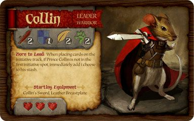

# LandProtect
> Sources : OneNote `WAFE - LandProtect.docx` (19 nov. 2020) + OneNote `Général.docx` + Notion `Base et de survie.md`
> Origine WAFE — voir [WafeUnivers.md](WafeUnivers.md) · Projet devenu indépendant de l'univers WAFE

---

## Résumé

| | |
|---|---|
| **Thème** | Éléments, Animaux, Survie, Construction, Exploration |
| **État** | En cours |
| **Type** | Plateau hexagonal — stratégie coopérative |
| **Joueurs** | 2 à 4 |
| **Difficulté** | Moyen |
| **Interaction** | Coopération |
| **Envie de dév.** | 2 |
| **Inspirations** | ARMELLO, Mice and Mystics, Voice of Cards |

> *Jeu d'exploration coopératif sur plateau hexagonal à révélation progressive. Chaque joueur incarne un héros animal aux mécaniques radicalement différentes. Les tuiles révélées peuvent être des ressources, un marché, un village ou un monstre. Le système élémentaire (Terre / Air / Eau / Feu) structure à la fois les sorts et les ressources.*

---

## Concept

- Exploration par **pose d'hexagones** (révélation dynamique)
- Chaque hexagone peut être : Ressources · Marché · Village · Monstre
- Chaque héros joué **totalement différemment** — exemples :
  - Combat avec un déplacement fixe
  - Un "fou" avec un dé à 3 faces donnant des actions variées
  - Un héros qui gère 3 pions soldats + son propre personnage
  - Un héros aux capacités psychiques

---

## Rôle des éléments

| Élément | Besoin vital (origine) | Sort |
|---------|----------------------|------|
| **Terre** | Construire | Protection de la terre — protège de 2 pts de dégâts |
| **Air** | Transport | Coup de vent — ajoute 2 déplacements |
| **Eau** | Boire | Eau soignante — rend 2 PV à soi-même ou un allié |
| **Feu** | Réchauffer | Flammèche — inflige 2 pts de dégâts |

---

## Personnages

### Races et héros

| Race | Héros | Type |
|------|-------|------|
| Volant | Hervé le Geai | — |
| Nageant | Lulu la Tortue | — |
| Prédateur | Bernard le Renard | — |
| Terrestre | Martin le Lapin | — |

*(Fiche personnage illustrée présente dans les sources Notion — voir images)*

---

## Équipements

### Ressources

Bois · Eau · Terre

### Armes & Armures

*(À développer)*

---

## Plateau

### Tuiles / Environnement

Tuiles de forme **hexagonale**.

| Terrain | Effet |
|---------|-------|
| Plaine | Tuile de base — aucun effet |
| Montagne | Nécessite 2 déplacements |
| Rivière | Termine les déplacements d'un personnage |
| Marais | Inflige des dégâts |
| Forêt | *(à définir)* |
| Sable | *(à définir)* |
| Brume | *(à définir)* |

---

## Événements

### Météorologiques

| Événement | Effet |
|-----------|-------|
| Pluie | Réduction des déplacements |
| Brouillard | *(à définir)* |

### Scénarisés

| Événement | Effet |
|-----------|-------|
| Rébellion | PNJ qui partent |
| Épidémie | Perte de vie |

### Économiques

| Événement | Effet |
|-----------|-------|
| Inflation | Augmentation des prix |
| Marché noir | Réduction des prix |

---

## Références

| Référence | Ce qui est emprunté |
|-----------|-------------------|
| ARMELLO (jeu vidéo) | Types de terrains · Cartes utilisables (armes, pièges) · Héros |
| Mice and Mystics (jeu de société) | Fiche personnage · Liste des attaques · Fonctionnement des tours |
| Voice of Cards | Cartes personnage · Cartes sorts · Partage de la mana |
| DungeonDraft | Cartographie |
| Danmachi | Tour + Arbre de talent |
| Skyrim | Arbre de talents |
| New World | Éléments |
| Albion Online | Arbre d'apprentissage |
| Child of Light & Grandia | Système de tours |
| Pokémon | Attaques / Types |
| Chained Echoes | Spells |
| Disco Elysium | Stats |

---

## Images (sources Notion)

- `assets/base-et-survie/image.png` — Fiche personnage
- `assets/base-et-survie/image 1.png` — Fiche personnage (suite)
- `assets/base-et-survie/image 2.png` — Plateau type

---

<!-- SOURCE-ARCHIVE:BEGIN -->
## Annexe — Notes sources exhaustives

Afficher la transcription exhaustive — WAFE LandProtect (nov. 2020)

> Cette annexe est la couche de référence restaurée depuis Mixologie avant restructuration (7db5550). Elle ne doit pas être condensée. Seuls les chemins des médias ont été adaptés à la nouvelle arborescence.

> **Couche exhaustive — WAFE — LandProtect.** Ce document conserve les formulations, variantes, répétitions, dates, tableaux et médias issus des exports. Il fait foi lorsqu'une synthèse éditoriale simplifie ou interprète un point.

# WAFE — LandProtect

## Général

jeudi 19 novembre 2020

14:57

Terre : Construire

Air : Transport

Eau: boire

Feu : Réchauffer

Afficher la transcription exhaustive — Base et de survie (ChatGPT V2)

> Cette annexe est la couche de référence restaurée depuis Mixologie avant restructuration (7db5550). Elle ne doit pas être condensée. Seuls les chemins des médias ont été adaptés à la nouvelle arborescence.

> **Couche exhaustive — ChatGPT V2.** Ce document conserve les formulations, variantes, répétitions, dates, tableaux et médias issus des exports. Il fait foi lorsqu'une synthèse éditoriale simplifie ou interprète un point.

# Base et de survie

## Fiche projet

| Propriété | Valeur |
|---|---|
| Initiateur | Yann Danjaume |
| État | En cours |
| Interaction | Coopération |
| Type de jeu | Plateau, Stratégie |
| Nbr joueurs | 2 à 4 |
| Difficulté | Moyen |
| Envie de développer | 2 |
| Thème | Animaux |

Construction

Exploration avec pose d'hexagone

Hexagone = ressources, marché, village, monstre

Chacun un héros étant joué totalement différament par exemple : combat avec un déplacement, un fou avec un dès 3 donnant différentes actions, un autre qui gère 3 pion soldat + son héro, un autre ayant des capacité spychique etc.

# Référence

- ARMELLO (Jeu vidéo) :
    - Type de terrains
    - Cartes utilisables (Armes, pièges, …)
    - Héros
- Mice and mystics (jeu de société)
    - Fiche personnage
    - Liste des attaques
    - Fonctionnement des tours
- Voice of cards :
    - Cartes personnage
    - Cartes sorts
    - Partage de la mana

# Personnages

## Fiche personnage

## Races

- Volant
    - Hervé le Geai
- Nageant
    - Lulu la Tortue
- Prédateur
    - Bernard le Renard
- Terrestre
    - Martin le Lapin

## Sorts

- Eau
    - Eau soignante : rend 2 pts de vie à soi-même ou un allié
- Terre
    - Protection de la terre : protège de 2 pts de dégats
- Feu
    - flammèche : inflige 2 pts de dégats
- Air
    - Coup de vent : Ajout 2 déplacements

# Equipements

## Armes & Armures

## Ressources

- Bois
- Eau
- Terre

## Autre

# Plateau

## Tuiles/Environnement

Les tuiles seraient de formes hexagonales.

- Plaine : Tuile de base
- Montagne : Nécessite 2 déplacements
- Rivière : Termine les déplacements d'un personnage
- Marais : Inflige des dégats
- Forêt :
- Sable :
- Brume :

# Evenements

- Météorologiques
    - Pluie : réduction des déplacements
    - Brouillard
- Scénarisé
    - Rébellion : PNJ qui partent
    - Epidémie : Perte de vie
- Economique
    - Inflation : Augmentation des prix
    - Marché noir : réduction des prix

<!-- SOURCE-ARCHIVE:END -->
