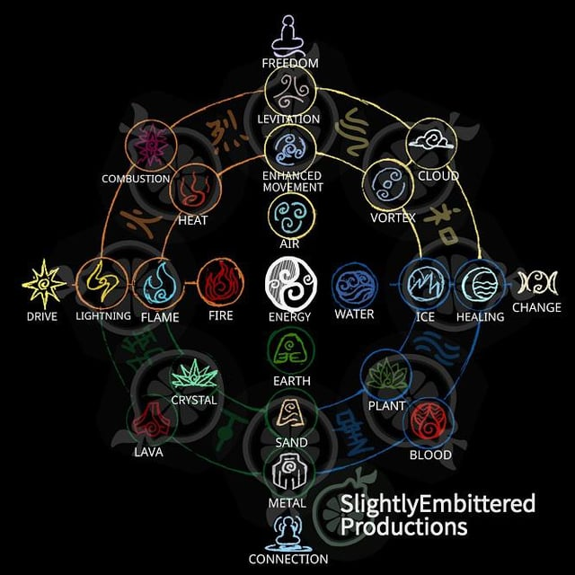
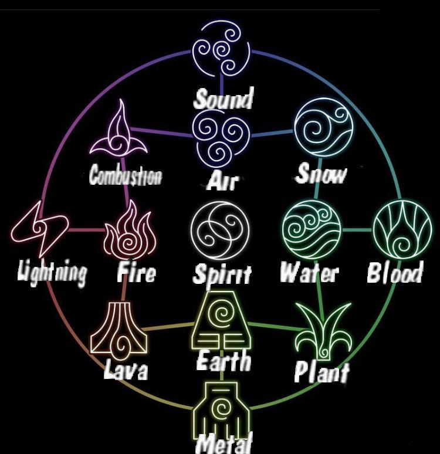
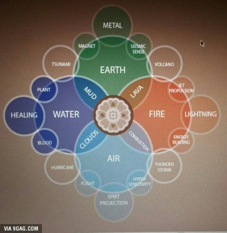

# WAFE

Source : [WAFE.docx](../../../../Sources/OneNote/.Docx/WAFE.docx)

> Transcription structurée de l’export DOCX OneNote. L’ordre des paragraphes, listes, tableaux, liens et images est conservé.

## Général

vendredi 3 décembre 2021

09:22

- Le meilleur joueur de chaque arme apparait comme le maitre de cette arme

- Le jeu serait un turn bases rpg sur tuiles au mode échec en mode duelyst

- Le créateur de la planète serait un arbre qui distribue les âmes comme des graines ce qui donne la vie aux êtres vivants. Et il récupère les âmes mortes avec ses racines pour se nourrir.

- Sur le plateau le personnage serait le roi d'échec et il aurait des pions

- La première attaque humaine/animale/élément est un coup de baseCaractéristiques et Progressions

Référence :

- Skyrim : arbre de talents

- New World : elements

- Albion : arbre

- Child of light : tours

- Pokemon : attaque

- Danmachi : talents, tour, dieux

- Chained Echoes : spells

- Seven deadly sin => pouvoirs dieux

## ToDo

vendredi 10 décembre 2021

20:23

  - Réfléchir aux attaques d'armes sur un plateau d'échec

  - Regarder Albion pour l'arbre des talents

  - Faire l'arbre des caractéristiques

    - 7 slots pour les attaques dont le première obligatoire qui est du type de l'être vivant

    - Les points de caractéristiques

    - Les types (humain, animal, élément)

  - Faire les attaques d'armes

## Notes

dimanche 14 novembre 2021

14:54

Création de la terre : 

- Création de la planète

- Création du soleil et la lune

- Création des éléments

- Création des animaux/plantes

- Création des humanoïdes

- Création des divinités

- Repos 

3 bases : 

- Éléments

  - Eau (Nordique) clanique

  - Terre (Indien) socialisme

  - Feu (Egypte) Junte Militaire

  - Air (Maya) (Théocratie)

- Animaux (Doluo)

- Humanoïde

- divinités et cataclysme

- Createur 

Cycles :

- Saisons

- Naissance/Vie/vieillesse/mort

- aube/jour/crépuscule/nuit Factions/

Religions :

- Lumière(Ordre)

- Ombre(Liberté) 

- Science

Quartiers : 

- Religion

- Science(Technologie)

- Guerre

- Nature

- Commerce 

Caractéristiques : 

- Métiers (New World + donjon master + eleveurs de monstres)

- Armes (Albion) Donjons : adaptatif en fonction 

Caractéristiques : 

- Force

- Agilité

- Puissance

- Concentration

- Esprit

- Endurance

- Physique

- Armure 

Monstres : 

- Dragons

- Mythologie Grecque (Minotaure, Gorgone,...) 

- Mythologie Nordique (Géants, serpent des mers, trolls,...)

- Dinosaures 

Système d'alignement. 

Références : 

- the begin After the end ( éléments + beast )

- New World (caracts + armes + metiers)

- Albion ( armes + métiers)

- pokémon (éléments) 

- démon slayer (éléments)

- Zelda botw (carte)

- Donjon ni ... Danmachi (Tour + dos des héros)

- Biomutant Arbre 

- Skyrim

- Child of light : tour par tour

Cercle de référence :

- Jour/Nuit

- éléments + éléments secondaires

- éléments dérivés (terre -> sable,…)

- animaux - nations (Japon,…)

- Armes

- Métiers

- Caractéristique

- saisons

## Mythologie

dimanche 14 novembre 2021

14:48

  - Créateur

  - (Soleils)

  - Astres

  - Dieux

    - Divinités

    - Calamités

  - Humanoïdes 

    - Humains

    - Elfes

    - Nains

  - Faune/Flore

    - Plantes

    - Animaux

      - Aquatique

        - Poissons

        - Tortues

        - Batraciens

      - Volants

        - Oiseaux

      - Reptiles

      - Mammifères

        - Herbivores

          - Rongeurs

            - Herisson

            - Lapin

        - Prédateurs

      - Insectes

        - Menthe

  - Eléments

    - Primaires

      - Primaires +

    - Secondaires

  - Alignement

    - Jour

    - Nuit

## Correspondance

dimanche 14 novembre 2021

15:14

| **Eléments** | Feu | Lave | Terre | Bois | Eau | Brume | Vent | Foudre |
| --- | --- | --- | --- | --- | --- | --- | --- | --- |
| **Animaux** | Reptiles Félins | Prédateurs Tortues | Mammifères Betails Ruminants | Insectes Ours Loups | Poissons | Batraciens/Tortues | Oiseaux | Rongeurs Félins |
| **Armes** | Hache | Marteau | Bouclier | Bâtons | Trident | Dagues | Arc Boomerang | Lance |
| **Métiers** |  | Forge |  |  |  | Alchimiste |  |  |
| **Races** | Grand fin |  | Petit trapu |  | Grand Trapu |  | Petit Fin |  |
| **Caract** | Puissance |  | Vitalité |  | Esprit |  | Vitesse |  |
| **Nations** | Egyptiens Arabes | Russes | Indiens |  | Nordiques Pirates | Japon Chinois | Tibet | Grecs |
| **Calamité** | Lion | Ours | Buffle | Loup Cerf | Kraken Naga | Grenouille | Aigle | Panthère |
| **Politique** | Monarchie | X | Socialisme | X | Clanique | X | Théocratie | X |
| **Biome** | Sable | Volcan | Montagne | Forêt | Fjords Iles Cascades Lacs | Marécage/Bambous | Iles dans le ciel |  |

## DTL - Elements

dimanche 14 novembre 2021

15:03

|  |  | LUMIERE Croisé/Rétributeur |  |  |
| --- | --- | --- | --- | --- |
|  | LAVE Artilleur Pouzzolane | FEU Pyromancien Fumée Explosions | FOUDRE Roublard Magnétique |  |
| METAL Paladin/Chevalier | TERRE Protecteur Sable Pierre | ORIGINE | AIR Danseur Levitation Tornades | SON Barde / Ménestrel |
|  | BOIS Druide/Chaman Plantes Fleurs (poison) | EAU Guérisseur/Sage Bulles Eaux pures Sang | BRUME Alchimiste Poisons Antidotes Gaz |  |
|  |  | GLACE Erudit |  |  |

  - Feu

    - Feu bleu : Destructeur

    - Foudre : Executeur/Roublard

  - Air :  Danseur

    - Son : Barde/Ménestrel

    - Brume : Alchimiste

  - Eau

    - Glace : Guérisseur

    - Bois : Chamane/Druide

  - Terre

    - Metal : Protecteur

    - Lave : Retributeur/Paladin/Croisé

## LST - Nations

dimanche 14 novembre 2021

14:54

  - Amérique

    - Incas

    - Aztèques

    - Maya

    - Indiens

  - Afrique

    - Perses

    - Egyptiens

    - Peuple Arabe

  - Européen

    - Grec

    - Romains

    - Nordique (Vikings)

    - Celtes

  - Asiatiques

    - Chinois

    - Japon

    - Tibet

  - Iles

    - Maoi

## LST- Armes

dimanche 14 novembre 2021

14:54

Fonctionnemnet

  - Les doubles armes et deux mains sont une amélioration de l'arme simple

    - Exemples : 

      - Epée à une main

        - Epée simple

        - Dual sword

        - Double hand sword

Liste des armes :

  - Arme Pugilat

  - Lance/Hast

  - Eventail ?

  - Arc

  - Arbalète

  - Epée

    - Rapière

    - Espadon

  - Hache

  - Marteau

  - Masse

  - Bouclier

  - Dagues

  - Bâton

  - Arme de jet

  - Torche

  - Bolas

  - Faux

  - Trident

  - Boomerang

  - Armes à feux

Classification

  - Tranchant

    - Dagues

      - Simple

      - Dual

      - DoubleHand

    - Epée

      - Simple

        - Rapière

      - Dual

      - DoubleHand

    - Hache

      - Simple

      - Dual

      - DoubleHand

    - (Faux)

      - Simple

      - DoubleHand

      - Faux + Poid

  - Baton

    - Lance

      - Simple

      - Dual

      - DoubleHand

    - Spécifique

      - Hast

      - Trident

    - Baton

      - Simple (matraque)

      - Double (Tonfa)

      - Baton long

  - Contendant 

    - Masse (piercing)

      - Simple

      - Dual

      - DoubleHand

    - Marteau (hitting)

      - Simple

      - Dual

      - DoubleHand

    - Pugilat

      - Contendant

      - Avec lames

      - Avec défense

  - (Magique)

    - Air

      - Eventail

      - Instruments

    - Feu

      - Torche

      - Armes à feu

    - Terre

      - Métaux

    - Eau

      - Coraux

  - OffHand

    - Boucliers

      - Simple

      - Double

    - Buff

      - Torche

      - Elements ?

  - Distance

    - Arc

      - Long

      - Court

    - Lanceurs

      - Lance pierre

      - Fronde

    - A lancer

      - Shuriken

      - Bolas

      - Boomerang

    - (Arbalète)

      - Simple

      - DoubleHand

    - (Arme à feu)

      - Fusil

      - Pistolet

## LST - Armures

jeudi 16 juin 2022

19:06

## LST - Métiers

dimanche 14 novembre 2021

15:14

  - Récolte

    - Pêche

    - Dépeçage

    - Herboriste

    - Minage

      - Mineur

      - Tailleur de pierre

    - Bucheron

    - Paysan

      - Eleveur

      - Agriculteur

  - Transformation

    - Cuisine

    - Alchimiste

    - Forgeron

    - Tisseur

    - Travailleur du cuir

    - Joaillerie

    - Ingénierie

    - Religion ?

    - Donjon Master ?

    - Eleveur ?

    - Fermier ?

## LST - Caractéristiques

dimanche 14 novembre 2021

15:54

- Défense/Protection

  - Vitalité (élément)

  - Armure

- Attaque

  - Puissance (élément)

  - Force (Beast)

- Contrôle/Buff

  - Concentration/Vitesse/Cooldown (éléments)

  - Dextérité/Agilité/Cooldown (Beast)

- Soin

  - Sagesse (élément) => Regen

  - Vitalité (Beast) => Regen

Force - dégât physique

Agilité - vitesse attaque

Endurance - santé

Intelligence - puissance magique

Logique - cooldown

Esprit - regen

Base

Santé => Vie

Magique

Intelligence => Puissance magique

Logique => Cooldown magique

Esprit => Quantité d'énergie magique

Volonté => Resistance magique

Physique

Force => Puisssance Physique

Agilité => Cooldown Physique

Endurance => Quantité d'énergie Physique

Résilience => Resistance Physique

---

- Resistance 

  - Resistance magique

  - Resistance physique

  - Vie

  - Armure

- Autre

  - Nombre de déplacement

- Magie

  - Puissance

  - Cooldown

  - Quantité

  - Regen

- Physique

  - Puissance 

  - Cooldown

  - Quantité

  - Endurance

[https://www.aidedd.org/regles/caracteristiques/](https://www.aidedd.org/regles/caracteristiques/)

  - [**Force**](https://www.aidedd.org/regles/caracteristiques/), mesure la puissance physique

  - [**Dextérité**](https://www.aidedd.org/regles/caracteristiques/), mesure l'agilité

  - [**Constitution**](https://www.aidedd.org/regles/caracteristiques/), mesure l'endurance

  - [**Intelligence**](https://www.aidedd.org/regles/caracteristiques/), mesure le raisonnement et la mémoire

  - [**Sagesse**](https://www.aidedd.org/regles/caracteristiques/), mesure la perception et l'intuition

  - [**Charisme**](https://www.aidedd.org/regles/caracteristiques/), mesurer la force de la personnalité

À partir de l’adresse <[*https://www.aidedd.org/regles/caracteristiques/*](https://www.aidedd.org/regles/caracteristiques/)> 

## PVP

dimanche 14 novembre 2021

15:24

  - Arènes

  - GvG

  - Pvp sauvage

  - Battleground

    - Capture drapeau

    - Capture point

    - Rugby

## PVE

dimanche 14 novembre 2021

15:26

- Donjons

  - Tour avec niveaux (Danmachi/SAO)

  - Donjons par éléments

- Calamités

Liste donjons :

- Dinosaures

- Fond des océans

- Zones mythologiques :

  - Grèce (Minotaure, Gorgone,...)

  - Egypte
